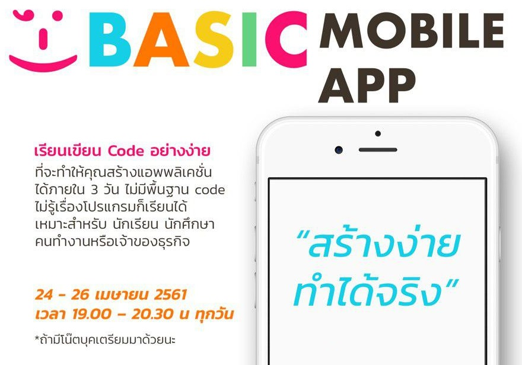

# Mobile app สร้างง่าย ทำได้จริง

## เนื้อหาประกอบคอร์ส
* วันที่ 1
    * [รู้จักกันหน่อยไหม :)](https://gitpitch.com/Sakul/ionic?p=day-1)
    * [เว็บไซต์หลักของ Ionic framework](https://ionicframework.com)
    * [Ionic Creator แค่ลากวางก็ได้ App!](https://creator.ionic.io)
    * ข้อดี ~ ข้อเสีย ของ Ionic Creator
* วันที่ 2
    * [การติดตั้ง Ionic](installing-ionic.md)
    * [โครงสร้างโปรเจค](tutorial-structure.md)
    * Command line game ;)
    * [มาสร้าง Ionic app ตัวแรกของเรากันเถอะ](tutotial-ionic.md)
    * App ตัวแรกบนมือถือของฉัน Ionic DevApp
* วันที่ 3
    * [Ionic Cloud](https://dashboard.ionicframework.com)
    * สร้างและทำงานร่วมกับ Ionic Cloud
    * คำสั่ง Git เบื้องต้น
    * ดู App ผ่าน Ionic View
    * App ถ่ายรูป
    * App พูดได้
    * ไป Academy กัน

## โปรแกรมที่ต้องใช้
* macOS
    * [NodeJs](https://nodejs.org/dist/v8.11.1/node-v8.11.1-x64.msi)
    * [VSCode](https://go.microsoft.com/fwlink/?Linkid=620882)
* Windows 64-bit
    * [NodeJs](https://nodejs.org/dist/v8.11.1/node-v8.11.1-x64.msi)
    * [VSCode](https://go.microsoft.com/fwlink/?Linkid=852157)
    * [TortoiseGit](https://download.tortoisegit.org/tgit/2.6.0.0/TortoiseGit-2.6.0.0-64bit.msi)
* Windows 32-bit
    * [NodeJs](https://nodejs.org/dist/v8.11.1/node-v8.11.1-x64.msi)
    * [VSCode](https://go.microsoft.com/fwlink/?Linkid=623230)
    * [TortoiseGit](https://download.tortoisegit.org/tgit/2.6.0.0/TortoiseGit-2.6.0.0-32bit.msi)
* Android
    * [Ionic Creator](https://play.google.com/store/apps/details?id=io.ionic.creator)
    * [Ionic DevApp](https://play.google.com/store/apps/details?id=io.ionic.devapp)
    * [Ionic View](https://play.google.com/store/apps/details?id=com.ionicframework.view)