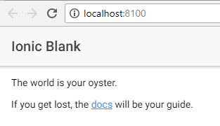

# การติดตั้ง Ionic

Ionic apps ถูกสร้างและพัฒนาโดยใช้ Ionic command line (CLI) เป็นส่วนใหญ่ และใช้ Cordova ในการทำให้กลายเป็น native app ดังนั้นเราเลยจำเป็นต้องทำการติดตั้งโปรแกรมต่างๆเพื่อที่จะนำไปสร้าง app ดังนี้

### การติดตั้ง Node

เครื่องมือส่วนใหญ่ที่เราใช้จะเป็น CLI ที่ทำงานกับ Node 
โดยสามารถดาวโหลดได้จาก 
[NodeJS installer](https://nodejs.org/) ซึ่งให้ดาวโหลด LTS version ล่าสุด และต้องปิด terminals/command prompts ก่อนทำการติดตั้ง  
หลังจากติดตั้งเสร็จให้ทำการตรวจสอบเวอร์ชันว่าเป็นเวอร์ชันล่าสุดหรือไม่ โดยทำการเปิด terminal window แล้วใช้คำสั่ง
```
npm --version
```

### Ionic CLI และ Cordova

หลังจากติดตั้ง Node เสร็จแล้วเราจะทำการติดตั้ง Ionic และ Cordova CLI โดยใช้คำสั่ง

```
npm install -g ionic cordova
```

> หมายเหตุ: คำสั่ง `-g` หมายถึงเป็นการติดตั้งแบบ global  
> สำหรับ Window คุณอาจจะต้องเปิด command prompt โดยเป็น Admin  
> สำหรับ Mac/Linux คุณจะต้องเรียกผ่าน `sudo`

เมื่อติดตั้งเสร็จแล้ว เราจะทำการสร้าง Ionic app ตัวแรกของเราโดยใช้คำสั่ง

```
ionic start helloWorld blank
```

หลังจากคำสั่งทำงานเสร็จแล้ว เราจะต้องใช้คำสั่งด้านล่าง เพื่อเข้าไปยังโฟเดอร์ที่ถูกสร้างขึ้นมาใหม่
```
cd helloWorld
```

หลังจากนั้นเราจะเรียก app ของเราขึ้นมาดูบน browser ด้วยคำสั่งด้านล่างนี้
```
ionic serve
```




[อ้างอิง](https://ionicframework.com/docs/intro/installation)