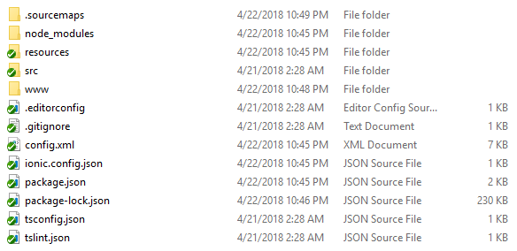
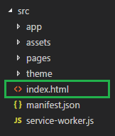
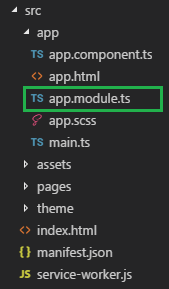
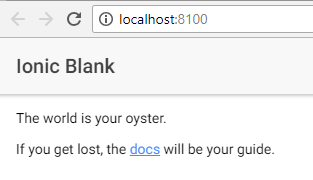

# โครงสร้างโปรเจค

คราวนี้เราจะได้ลองดูส่วนประกอบต่างๆของตัว Ionic app ที่เราได้สร้างขึ้นมากันบ้าง โดยตัวโปรเจคของเราจะเป็นลักษณะของ [Cordova](/docs/v1/what-is/#cordova) ซึ่งเจ้าตัว Cordova คือตัวที่จะทำให้เราติดตั้ง native plugins และ platform-specific ได้



# ./src

ภายในโฟเดอร์ `src` เราจะพบ code ของเรา ซึ่งเจ้า code ต่างๆเหล่านี้แหละที่ทำหน้าที่ทำให้ app ของเราทำงานได้ ดังนั้นเวลาเราเขียน code เราจะมาเขียนไว้ที่โฟเดอร์นี้

ถ้าเราใช้คำสั่ง `ionic serve` เมื่อไหร่ ตัวโปรแกรมจะทำการแปลง code [transpiled](/docs/resources/what-is/#transpiler) ทั้งหมดที่อยู่ภายในโฟเดอร์ `src` ให้กลายเป็นภาษา Javascript ที่ตัว browser สามารถเข้าใจและนำไปแสดงผลต่อได้ [ES5](/docs/resources/what-is/#es5)
จากที่กล่าวมาทำให้เราพัฒนา Ionic app โดยใช้ภาษา TypeScript ได้ แล้วค่อยทำการแปลงภาษา TypeScript ให้กลายเป็นภาษา Javascript เพื่อให้ browser สามารถนำไปทำงานต่อได้

# ./src/index.html


`src/index.html` คือจุดแรกสุดที่ตัว Ionic app จะทำการเปิดขึ้นมา ซึ่งเจ้าไฟล์นี้มีหน้าที่ในการจัดการเตรียมการทุกอย่างให้ตัว app ของเราพร้อมทำงาน เช่นเตรียม script, CSS ทำ bootstrap ซึ่งในตอนนี้เรายังไม่จำเป็นจะต้องลงรายละเอียดกับไฟล์นี้มากนัก

สิ่งที่น่าสนใจของไฟล์นี้คือ tag ที่ชื่อว่า `<ion-app>`

```html
<ion-app></ion-app>
```

ซึ่งจะตามมาด้วย scripts ด้านล่าง 3 ตัว ตามตัวอย่างด้านล่าง

```html
<!-- Ionic's root component and where the app will load -->
<ion-app></ion-app>

<!-- The polyfills js is generated during the build process -->
<script src="build/polyfills.js"></script>

<!-- The vendor js is generated during the build process
     It contains all of the dependencies in node_modules -->
<script src="build/vendor.js"></script>

<!-- The main bundle js is generated during the build process -->
<script src="build/main.js"></script>
```

เจ้าพวก scripts พวกนี้ถูกสร้างขึ้นโดยอัตโนมัติหลังจากที่เราสร้าง app ซึ่งตอนนี้ยังไม่ได้ต้องสนใจกับพวกมันมากนัก

# ./src/app/app.module.ts
ไฟล์ `src/app/app.module.ts` คือจุดแรกของ code ที่โปรแกรมจะเริ่มทำเข้ามาทำงานด้วย



เมื่อทำการเปิดดูภายในไฟล์เราจะพบ code ที่มีหน้าตาเหมือนกับตัวอย่างด้านล่างนี้

```ts
@NgModule({
  declarations: [MyApp, HomePage],
  imports: [BrowserModule, IonicModule.forRoot(MyApp)],
  bootstrap: [IonicApp], 
  entryComponents: [MyApp, HomePage],
  providers: [StatusBar, SplashScreen, {provide: ErrorHandler, useClass: IonicErrorHandler}]
})
export class AppModule {}
```

โดยปรกติโปรแกรมจะมีสิ่งที่เรียกว่า _root module_ ที่คอยทำหน้าที่ควมคุมการทำงานของ app ทั้งหมด (ที่คล้ายกับ `ng-app` ที่อยู่ใน Ionic 1 และ AngularJS)

ภายใน module นี้จะทำหน้าที่ในการกำหนด root component เป็น MyApp ที่อยู่ในไฟล์
`src/app/app.component.ts` ดังนั้น MyApp component จะถูกโหลดมาใช้งานเป็น component แรก และโดยปรกติมันจะไม่มีอะไรเพื่อเตรียมรองรับ components อื่นๆที่จะโหลดเข้ามาต่อ

ถ้าเราทำการเปิดไฟล์ `app.component.ts` เราจะพบว่าไฟล์ `src/app/app.html` ถูกกำหนดให้เป็น template ในการแสดงผลไว้แล้ว

# ./src/app/app.html

ถ้าเราทำการเปิดดูไฟล์ `src/app/app.html` เราจะพบ code ตามตัวอย่างด้านล่างนี้

```html
<ion-nav [root]="rootPage"></ion-nav>
```

จากตัวอย่างด้านบน ตัว template ได้กำหนดให้นำข้อมูลจากตัวแปร `rootPage` มาใช้ ซึ่งเจ้าตัว `rootPage` ถูกกำหนดว่ามันมาจาก `/pages/home/home` ซึ่ง component นี้ได้ใช้ template จากไฟล์ `./src/app/pages/home/home.html` มาแสดงผล ดังนั้นตัว app ของเราเลยทำการแสดงหน้าตาออกมาเป็นตามรูปด้านล่างนี้

